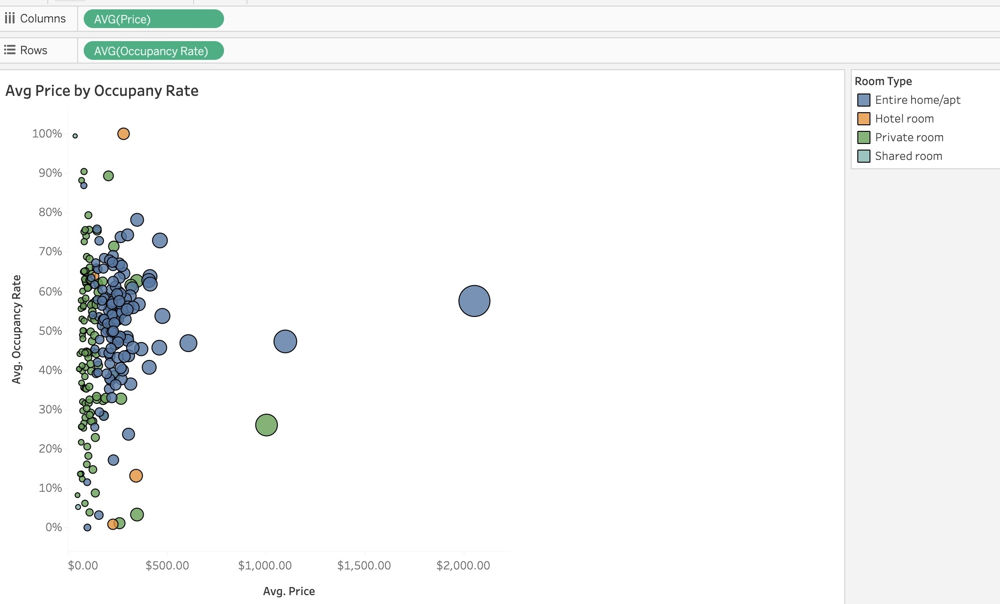

**Inside Brisbane’s Airbnb Economy**

**A data visualization project uncovering pricing, occupancy behaviour, and host performance across Brisbane’s short-stay rental market**

---

📌 **Project Overview — Why This Matters**

Airbnb continues to shape Brisbane’s housing and tourism economy — influencing affordability, neighbourhood character, and host profitability.

This dashboard tackles a key question:

**How do Airbnb pricing, occupancy and host performance vary across Brisbane — and what does this mean for hosts, investors, and future residents?**

This project originated from my own relocation planning — and evolved into a measurable look at short-stay market dynamics across the city.

---

**🎯 Objective**

This project analyses Brisbane Airbnb data to understand:

✔ Pricing differences across suburbs & room types
✔ How well listings convert into bookings
✔ Monthly revenue potential across the city

Everything — from data manipulation to dashboard design — was completed directly in **Tableau Public**.

---

📊 **Tableau Dashboard**

🔗 https://public.tableau.com/app/profile/presca.evans/viz/AirbnbBrisbanedataset/Dashboard1

---

🧠 **Tools & Methods**
🧠 **Tools & Methods**

| Phase               | Approach                                                      |
| ------------------- | ------------------------------------------------------------- |
| Data Cleaning       | Filtering incomplete rows + standardising neighbourhood names |
| Feature Engineering | Revenue + occupancy proxy calculations                        |
| Visual Analysis     | Pricing, demand and performance segmentation                  |
| Design              | Mobile-responsive dashboard + contextual tooltips             |

**Revenue Estimation Formula:**

([Price] * 30 * 0.6) * [Reviews Per Month]

Review frequency used as a proxy for bookings, given dataset limitations.

--- 

📌 **Key Performance Indicators (from Dashboard)**

| Metric                  |      Value |
| ----------------------- | ---------: |
| Total Listings          |  **5,695** |
| Total Hosts             |  **2,600** |
| Average Price           |   **$220** |
| Average Monthly Revenue | **$6,834** |

---

🖼 **Sample Visual Evidence**

**Room Type Pricing**

**Price vs Occupancy Scatter Plot** (📌 upload pending)

---

🔍 **Key Insights**

📌 **Entire homes command higher prices — but not higher occupancy**
Mid-priced listings often outperform on demand.

📌 **Central suburbs dominate supply & revenue**
Location convenience drives performance.

📌 **Revenue is more seasonal than price**
Demand rises and falls with tourism rhythms.

📌 **Pricing strategy must balance competition**
High price ≠ high returns.

📌 **Market shows clear segmentation**
Traveller preferences differ by neighbourhood & listing type.

These insights support decision-making for:

• Hosts setting competitive pricing
• Investors assessing property strategy
• Housing & tourism analysts monitoring short-stays

---

⚠ **Critical Data Limitation** 

This dataset reflects **Airbnb listings only**, excluding hotels and other short-stay options.

Underrepresentation of hotels means:

• Airbnb occupancy appears **inflated**

• Competitive pressure is **understated**

• Market conclusions must be interpreted cautiously

Additionally:

Data is a **snapshot in time**, not continuously refreshed
→ Insights show **market structure**, not current season-specific performance

---

🚀 **Future Enhancements**

• Add geospatial mapping of density + revenue patterns

• Cluster listings by amenities and pricing power

• Integrate hotel capacity + tourism demand (ABS / Queensland data)

• Seasonal decomposition → identify peak vs slump drivers

• Host-focused recommendations, e.g., “optimal price band by suburb”

• Neighbourhood context profiles (universities, CBD access, event venues)

These align with a clear skill-development pathway while strengthening real-world value.

---

📁 **Repository Structure**

Inside-Brisbane-Airbnb-Economy
│
├── README.md
├── images
│    ├── Room_Type_Pricing.jpeg
│    ├── price_vs_occupancy.jpeg (to add)
│
└── Data
     ├── listings_Brisbane.csv

---

🧍‍♀️ **Author**

**Dr. Presca Evans** — Data Analyst & Mixed-Methods Researcher
Focused on making service-access systems clearer, fairer & more human-centred.
📌 Relocating to Brisbane · December 2025

