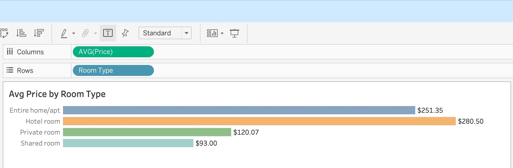
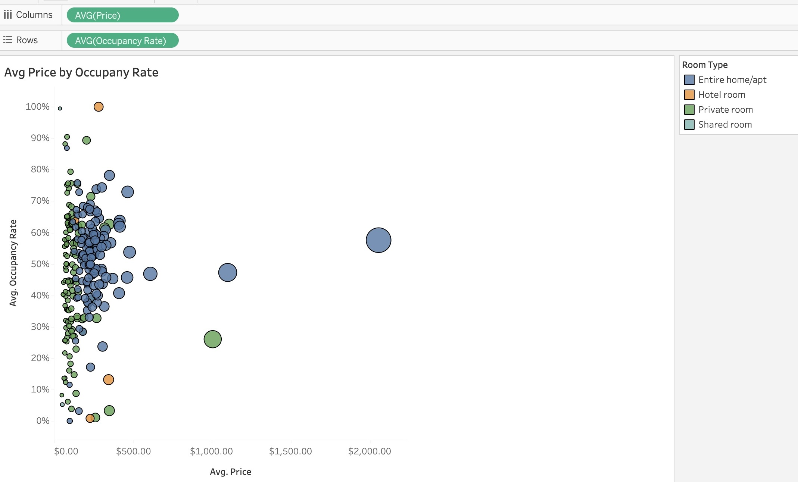

# Brisbane Short-Stay Market Visibility Pack
A **Reporting BA-style** visibility pack using **Brisbane short-stay listing data** to surface **pricing patterns**, **demand-proxy signals**, and **revenue potential indicators** that support clearer host, analyst, and investor decisions.

---

## 👩🏽‍💻 Author
**Presca Wanki** — **Service Performance & Insights Analyst (Reporting BA-style)**  
Focus: KPI definition, reporting requirements, data validation, and decision-ready insight for operational and commercial planning.

---

## ✅ At a glance
- **Primary decisions**
  - Where do price levels concentrate across Brisbane suburbs?
  - Which room types show the strongest price vs demand-proxy trade-offs?
  - Which suburbs and listing types show stronger **revenue potential** at a high level (proxy-based)?
- **Primary users**
  - Hosts / property managers
  - Market analysts / commercial strategy stakeholders
  - Investors seeking high-level suburb and room-type visibility
- **Tooling:** **Tableau Public** → **GitHub documentation**
- **Deliverables:** Reporting requirements, KPI glossary, validation notes, dashboard views, decision-ready insights, and planning-oriented actions

**📊 Tableau Public dashboard:**  
[Brisbane Airbnb Dashboard](https://public.tableau.com/app/profile/presca.evans/viz/AirbnbBrisbanedataset/Dashboard1)

> **Data note:** This project uses a dataset snapshot and proxy measures. It is designed for **market visibility and planning**, not as a real-time pricing engine.

---

## 🧩 What this project demonstrates
- **Reporting requirements definition** using user stories and acceptance criteria
- **KPI design and business rules** with explicit proxy logic and caveats
- **Data-quality governance** through standardisation, exclusions, and transparent assumptions
- **Decision-oriented dashboarding** focused on action, not just charts
- **Interpretation discipline** by clearly separating directional indicators from confirmed performance

---

## 🔎 Project overview
Brisbane’s short-stay market is shaped by location, listing type, and price positioning. Decision-makers often face a practical trade-off: **higher nightly price does not automatically imply stronger booking demand**.

This visibility pack is designed to answer three core commercial questions:

1. **How do price levels vary across suburbs and room types?**
2. **Where do demand-proxy signals concentrate?**
3. **Which suburbs and room types show stronger revenue potential at a high level (proxy-based)?**

Rather than presenting proxy measures as confirmed outcomes, this project treats them as **directional planning signals** that can help narrow options and support further investigation.

---

## 👥 Primary users

This reporting pack is designed for stakeholders who need a structured, high-level view of **short-stay pricing**, **listing mix**, and **commercial positioning** across Brisbane.

### Hosts / property managers
- Compare suburb and room-type pricing bands
- Review price vs demand-proxy trade-offs
- Support listing positioning and pricing discussions

### Market analysts / commercial strategy stakeholders
- Examine supply distribution and listing concentration
- Identify broad market patterns by suburb and product type
- Support market-visibility reporting and opportunity scans

### Investors seeking high-level visibility
- Shortlist suburbs and room types for further review
- Compare revenue potential across market segments
- Use directional indicators to guide deeper due diligence

> **Out of scope:** This project is not a real-time pricing tool, forecasting model, or financial valuation model. It is designed for **market visibility and directional planning**.

---

## 📌 Decisions this pack supports
- Shortlisting suburbs for **further market investigation**
- Comparing **room-type positioning** across suburbs
- Identifying where price appears misaligned with demand-proxy signals
- Highlighting areas with stronger **revenue potential indicators**
- Supporting more disciplined use of proxy-based market signals

---

## 📈 KPI summary (from dashboard)

| KPI | Value | What it represents |
|---|---:|---|
| Total Listings | 5,695 | Listings included in the dataset snapshot |
| Total Hosts | 2,600 | Unique hosts represented |
| Average Nightly Price | $220 | Average listed nightly price (directional) |
| Average Monthly Revenue (proxy) | $6,834 | Proxy-based revenue potential (see glossary formula + caveats) |

> **Important note:** Monthly revenue is presented as a **proxy** and should not be interpreted as audited earnings.

---

## 🧱 Delivery approach (Requirements → KPI rules → validated model → dashboard)

This project follows a **reporting delivery pattern**:

1. Define decision needs  
2. Define KPI rules and proxy logic  
3. Validate completeness and standardise key fields  
4. Publish dashboard views that support action  

---

## 1) Reporting requirements (user stories + acceptance criteria)

### User story 1 — Suburb pricing visibility
**As a host or investor,** I need suburb-level pricing visibility so I can compare neighbourhood price bands and shortlist areas to investigate further.

**Acceptance criteria**
- Suburb/neighbourhood labels are standardised
- Pricing view supports filtering by **Room Type**
- Listing counts (**base N**) are shown alongside price metrics for context

---

### User story 2 — Room-type pricing comparison
**As a host,** I need pricing comparisons by room type so I can position my offering against market expectations.

**Acceptance criteria**
- Room-type categories are consistent and clearly labelled
- Average price by room type is visible
- View supports drill-down by suburb



---

### User story 3 — Price vs demand proxy
**As a host,** I need to see how price relates to a demand proxy so I can avoid overpricing that may suppress booking interest.

**Acceptance criteria**
- Demand proxy is clearly defined and caveated in the KPI glossary
- Scatter view supports filtering by suburb and room type
- Dashboard includes an interpretation note: **proxy ≠ confirmed bookings or occupancy**



---

### User story 4 — Revenue potential comparison (proxy)
**As an investor or analyst,** I need a high-level revenue potential indicator so I can compare suburb and room-type opportunities directionally.

**Acceptance criteria**
- Revenue proxy formula is stated in the KPI glossary
- Output is labelled as **proxy / directional**, not audited revenue
- View supports filtering by suburb and room type

---

### User story 5 — Data trust and transparency
**As a reporting BA,** I need key assumptions and exclusions documented so stakeholders interpret results responsibly.

**Acceptance criteria**
- Proxy logic and limitations are explicit
- Missingness and cleaning approach are stated
- Any “Unknown” categories remain visible rather than silently dropped
- KPI labels are consistent across README and dashboard

---

## 2) KPI glossary (definitions & business rules)

| KPI / concept | Definition | Unit | Rules / caveats |
|---|---|---:|---|
| Nightly Price | Listed nightly price | $ | Directional; may not include all fees, discounts, or cleaning charges |
| Reviews per Month | Review frequency metric | Rate | Used as a **proxy** for booking intensity (imperfect) |
| Demand proxy | Directional signal derived from review frequency | Proxy | Not confirmed occupancy; affected by guest review behaviour and listing type |
| Monthly Revenue (proxy) | Proxy-based revenue potential indicator | $ (proxy) | **Formula:** `([Price] * 30 * 0.6) * [Reviews per Month]` |
| Listing Count | Number of listings | Count | Used for supply density and market context |
| Host Count | Unique hosts | Count | Used for market participation context |

**Important caveat:** Reviews are an imperfect proxy. Review rates vary by guest behaviour, stay type, host prompting, and listing characteristics.

---

## Limitations & assumptions
- This dataset represents **Airbnb listings only** and does not include hotels or other accommodation supply.
- Data is a **snapshot in time**, not a continuously refreshed market feed.
- Review-based measures are **proxies**, not confirmed bookings, occupancy, or audited revenue.
- Results should **not** be used as a direct pricing recommendation without validation against current market conditions and platform dynamics.
- Revenue potential is a **proxy indicator** intended to support further investigation, not investment valuation.

---

## 3) Data validation & quality handling

### Principles
- Keep interpretation honest: proxies are labelled as proxies
- Standardise key location fields before aggregation
- Filter incomplete records only where required for consistent KPI calculation
- Keep assumptions visible so readers understand what the dashboard can and cannot support

### Handling approach

| Risk area | Handling approach |
|---|---|
| Inconsistent suburb naming | Standardised neighbourhood/suburb labels before comparison |
| Incomplete records | Filtered only where required for consistent calculations |
| Proxy sensitivity | Demand and revenue treated as directional, not absolute truth |
| Category inconsistencies | Room-type labels standardised across views |

### Validation checks
- Room-type categories are consistent across all dashboard views
- Suburb labels are standardised before aggregation
- Listings with missing price or review fields are excluded only where required
- Proxy metrics are labelled consistently across the dashboard and README
- Base listing counts remain visible for pricing comparisons

---

## 4) Build & implementation (Tableau → documentation)

### Tech stack

| Component | Tool |
|---|---|
| Data prep / calculations | Tableau Public |
| Visualisation / BI | Tableau Public |
| Version control | GitHub |
| Documentation | README.md |

### Implementation summary
1. Load listing data into Tableau
2. Standardise suburb and room-type fields (grouping/cleaning rules applied)
3. Create calculated fields for demand proxy and monthly revenue (proxy)
4. Build filtered visuals for pricing, room type, and price-vs-demand comparison
5. Document KPI rules, assumptions, and limitations in the repo README

---

## 🌍 Key visuals (what to look for)

### 1) Room-type pricing comparison
**Look for:** how listed prices vary by room type and where premium positioning concentrates  


---

### 2) Price vs demand proxy
**Look for:** listings or segments where high price does not clearly align with stronger demand-proxy signals  


---

## 📌 Key insights (decision-ready)
- **Higher price does not automatically imply stronger demand proxy** — mid-priced listings can remain competitive depending on suburb and room type.
- **Entire homes typically command higher prices**, but stronger pricing should be interpreted alongside demand-proxy signals rather than price alone.
- **Supply and revenue potential concentrate in specific suburbs**, suggesting that location and market positioning matter more than headline price by itself.
- **Market segmentation is visible**: traveller preferences appear to differ by neighbourhood and room type, supporting more targeted pricing and positioning discussions.

---

## ✅ Recommended actions (hosts, analysts, and investors)

| Theme | Action | Expected benefit | Success measure |
|---|---|---|---|
| Pricing strategy | Use suburb bands and room-type benchmarks to set directional price ranges | More competitive positioning | Stronger price vs demand-proxy balance |
| Market screening | Shortlist suburbs with stronger demand-proxy and revenue proxy signals | Better prioritisation of follow-up analysis | Higher-quality shortlist for deeper review |
| Risk control | Validate proxy signals with other sources such as seasonality, events, and broader accommodation supply | Reduced overconfidence in a single dataset | Fewer decisions based on one indicator alone |
| Reporting discipline | Keep proxy definitions and caveats visible in all decision materials | More responsible interpretation | Consistent use of KPI rules and assumptions |

---

## 🚀 Future enhancements
- Add geospatial density and revenue-proxy mapping by suburb
- Segment listings by amenities and pricing power
- Integrate external context such as events, tourism indicators, and broader accommodation supply
- Produce suburb and room-type comparison packs for follow-up analysis
- Add a reproducible data-prep workflow outside Tableau for stronger pipeline traceability

---

## 📁 Repository structure

```text
Inside-Brisbane-Airbnb-Economy/
├── README.md
├── LICENSE
├── Data/
│   └── listings Brisbane.csv
└── Images/
    ├── Occupancy_Rate_Price.jpeg
    └── Room_Type_Pricing.jpeg